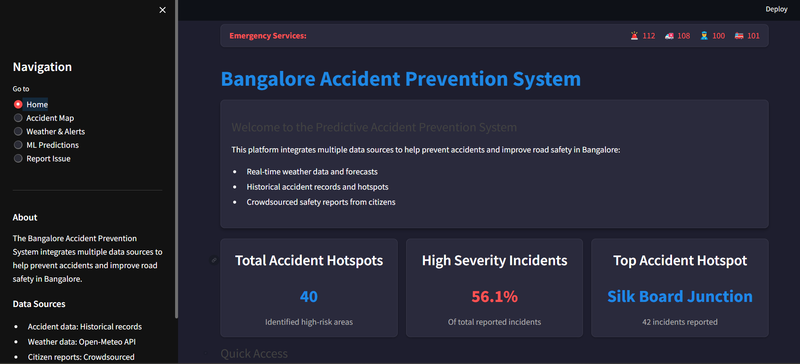
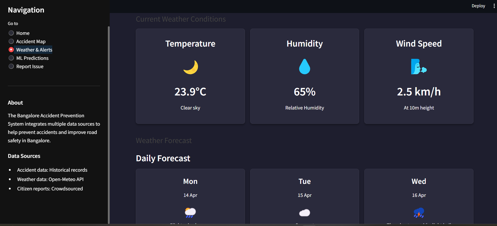
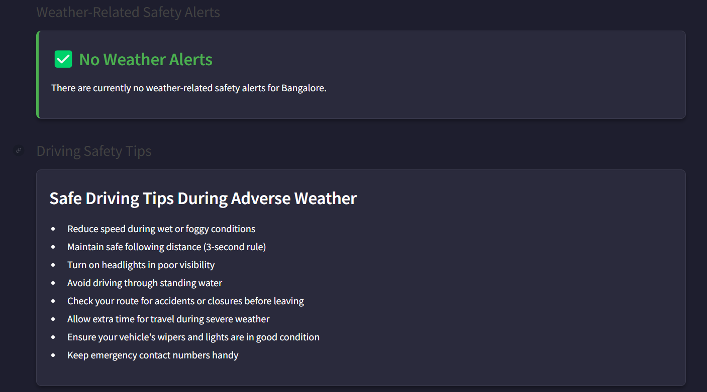

# SafeCityAI: Bangalore Accident Prevention System

## Application Screenshots

The following screenshots showcase the key features and interfaces of the SafeCityAI application:

### Home Page

*The main dashboard provides an overview of accident statistics, emergency service contacts, and key metrics for quick assessment of road safety in Bangalore.*

A comprehensive AI-powered platform for accident prevention and road safety in Bangalore. This system integrates real-time weather data, historical accident records, and machine learning predictions to help citizens navigate safely and report hazardous conditions.

## 🏆 Created for समAI - Time for AI Competition

This project is developed as part of the [समAI - Time for AI](https://wequity.acehacker.com/samai/) competition, which challenges participants to code, create, and innovate with Artificial Intelligence. SafeCityAI demonstrates how AI can be leveraged to create safer urban environments and potentially save lives through predictive analytics and community engagement.

## ✨ Key Features

### 🗺️ Interactive Accident Hotspot Map
- **Detailed Visualization**: View accident-prone areas across Bangalore with severity indicators
- **Filtering Options**: Filter hotspots by severity, incident count, accident type, and time of day
- **Multiple Map Views**: Switch between marker, heatmap, and cluster visualizations
- **Detailed Information**: Click on markers to see comprehensive accident data and contributing factors


*The interactive map visualizes accident hotspots across Bangalore with color-coded markers indicating severity levels, allowing users to identify high-risk areas at a glance.*

### 🤖 Machine Learning Predictions
- **Risk Prediction**: AI-powered prediction of accident likelihood based on multiple factors
- **City-wide Risk Map**: Color-coded visualization of risk levels across the entire city
- **Emerging Hotspot Detection**: Identification of new high-risk areas before they become problematic
- **Personalized Safety Recommendations**: Contextual safety advice based on current conditions


*The city-wide risk prediction map uses AI to visualize accident risk levels across Bangalore with a heat map overlay. Red areas indicate high-risk zones, yellow shows moderate risk, and green represents lower risk areas. Red markers pinpoint specific accident hotspots.*

### Recent Updates Section

*The recent updates section keeps users informed about road work, traffic signal changes, and other important traffic-related announcements with timestamps.*

### 🌦️ Weather & Safety Alerts
- **Real-time Weather Data**: Current weather conditions and forecasts for Bangalore
- **Weather-related Safety Alerts**: Automatic warnings when weather conditions may affect road safety
- **Forecast Integration**: 7-day weather forecast to help plan safer travel
- **Condition-specific Safety Tips**: Tailored advice for different weather conditions


*Real-time weather data showing temperature (23.9°C), humidity (65%), and wind speed (2.5 km/h) with clear sky conditions.*


*3-day weather forecast for March-April 2025 showing upcoming conditions: slight rain showers on Monday (April 14), overcast on Tuesday (April 15), and thunderstorm with slight hail on Wednesday (April 16).*


*Context-aware driving safety tips that update based on current and forecasted weather conditions, helping drivers navigate safely during adverse weather.*

### 📝 Citizen Reporting System
- **Issue Reporting**: Allow citizens to report road hazards and safety issues
- **Location Selection**: Interactive map for precise location reporting
- **Media Upload**: Support for uploading photos of hazardous conditions
- **Status Tracking**: Follow the status of reported issues


*Recent community reports showing citizen-submitted hazards with location details, issue type, severity level, and report status. Reports from April 2025 include a pothole on Outer Ring Road, a broken traffic signal, and waterlogging after rain.*

### 🚨 Emergency Services Integration
- **One-click Emergency Contact**: Quick access to emergency services at the top of every page
- **Direct Calling**: Integrated calling functionality for immediate assistance
- **Multiple Services**: Access to Police, Fire, Ambulance, and General Emergency services

*The emergency services bar at the top of the application provides quick access to important contact numbers (112 for Police, 108 for Ambulance, 100 for Emergency, 101 for Fire) for immediate assistance in case of accidents.*

### 🌐 Multilingual Support (Planned)
- Support for English, Hindi, and Kannada languages
- Easy language switching via the top navigation bar
- Localized emergency information and safety tips

### Footer
*The application footer displays copyright information (© 2025) and acknowledges that the system was created for the समAI - Time for AI competition, reinforcing the project's forward-looking vision.*

## 📊 Data & AI Components

### Data Sources
- **Accident Data**: Historical records of accident-prone areas in Bangalore
- **Weather Data**: Real-time and forecast data from Open-Meteo API
- **Citizen Reports**: Crowdsourced information about road hazards and safety issues

### AI & Machine Learning
- **Risk Prediction Model**: Analyzes multiple factors to predict accident likelihood
- **Hotspot Identification**: Uses clustering algorithms to identify accident-prone areas
- **Weather Impact Analysis**: Correlates weather conditions with accident frequency
- **Emerging Risk Detection**: Identifies new patterns in accident data to predict future hotspots

## 🔧 Technical Implementation

### Technology Stack
- **Frontend**: Streamlit for interactive web interface
- **Data Processing**: Pandas for data manipulation and analysis
- **Visualization**: Folium for maps, Plotly for interactive charts
- **Machine Learning**: Scikit-learn for predictive models
- **APIs**: Open-Meteo for weather data

### Architecture
The application follows a modular architecture with clear separation of concerns:
- **Data Layer**: Handles data loading, processing, and storage
- **Logic Layer**: Implements business logic, predictions, and data analysis
- **Presentation Layer**: Manages the user interface and visualization components

## 📝 Installation & Setup

### Prerequisites
- Python 3.8 or higher
- Git

### Installation Steps

1. Clone this repository:
   ```bash
   git clone https://github.com/Aditya-Ranjan1234/SafeCityAI.git
   cd SafeCityAI
   ```

2. Create a virtual environment and activate it:
   ```bash
   python -m venv venv

   # On Windows
   venv\Scripts\activate

   # On macOS/Linux
   source venv/bin/activate
   ```

3. Install the required packages:
   ```bash
   pip install -r requirements.txt
   ```

4. Configure environment variables (if needed):
   - Rename `.env.example` to `.env`
   - Add your API keys for weather services

## 🚀 Usage

1. Run the Streamlit application:
   ```bash
   streamlit run app.py
   ```

2. Open your web browser and navigate to:
   ```
   http://localhost:8501
   ```

## 📁 Project Structure

```
├── app.py                      # Main Streamlit application
├── requirements.txt            # Python dependencies
├── .env                        # Environment variables (API keys)
├── src/                        # Source code
│   ├── components/             # UI components
│   │   ├── emergency_services.py  # Emergency services components
│   │   ├── map_components.py   # Map visualization components
│   │   └── stats_components.py # Statistical visualization components
│   ├── data/                   # Data files
│   │   └── bangalore_accident_data.csv  # Accident hotspot data
│   ├── pages/                  # Application pages
│   │   ├── home_page.py        # Home page
│   │   ├── accident_map_page.py # Accident map page
│   │   ├── ml_predictions_page.py # ML predictions page
│   │   ├── weather_page.py     # Weather and alerts page
│   │   └── report_page.py      # Issue reporting page
│   └── utils/                  # Utility modules
│       ├── config.py           # Configuration settings
│       └── data_loader.py      # Data loading utilities
├── screenshots/                # Application screenshots for documentation
└── images/                     # Application screenshots for README
```

## 🤝 Contributing

Contributions are welcome! Please feel free to submit a Pull Request.

1. Fork the repository
2. Create your feature branch (`git checkout -b feature/amazing-feature`)
3. Commit your changes (`git commit -m 'Add some amazing feature'`)
4. Push to the branch (`git push origin feature/amazing-feature`)
5. Open a Pull Request

## 📜 License

This project is licensed under the MIT License - see the LICENSE file for details.

## 🙏 Acknowledgements

- [समAI - Time for AI](https://wequity.acehacker.com/samai/) for the opportunity to showcase this project
- [Open-Meteo](https://open-meteo.com/) for providing free weather API
- [Streamlit](https://streamlit.io/) for the excellent web application framework
- [Folium](https://python-visualization.github.io/folium/) for the interactive mapping capabilities
